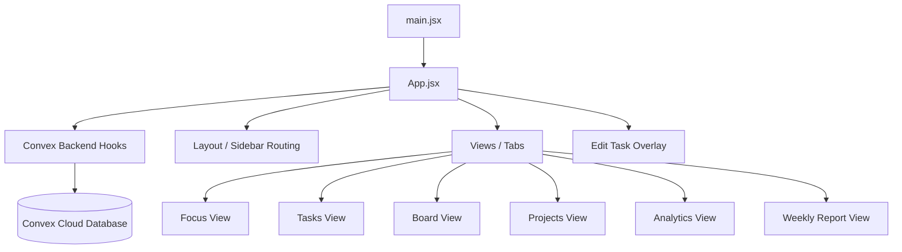

# Task Manager Architecture

This document describes the design, structure, and architecture of the Task Manager React application.

## Directory Structure

```
task-manager/
├── ARCHITECTURE.md       # Architecture documentation (this file)
├── index.html            # Main entrypoint index page for Vite
├── package.json          # Package definition and scripts
├── vite.config.js        # Vite compilation and bundler configuration
└── src/
    ├── App.jsx           # Main React component, state, and business logic
    ├── index.css         # Reset styles, global layout, keyframes, and hover classes
    └── main.jsx          # React DOM mounting entrypoint
```

## System Architecture

The application is structured as a lightweight React SPA (Single Page Application) compiled and served via Vite, connected in real-time to a Convex backend.



### 1. State Management

Application state is synchronized in real-time with the Convex backend using reactive queries and mutations:
* **`view`**: The current tab being displayed (e.g., `'focus'`, `'tasks'`, `'board'`, `'projects'`, `'analytics'`, `'weekly'`).
* **`tasks`**: Synchronized real-time array from Convex.
* **`projects`**: Synchronized real-time array from Convex.
* **`filters`**: Local search and filter settings (search phrase, project filter, urgency level, status defaulting to `'active'` to hide Done tasks by default, and task type filter defaulting to `'all'`).
* **`panel`**: Tracks the display and state of the edit/creation sidebar overlay, now including `dateType` selection.
* **`projectForm`**: Draft fields for new project additions.
* **`editingProject`**: Draft fields (id, name, description) for editing an existing project.
* **`weekKey`**: Tracks the selected week in the Weekly Report.
* **`mobileMenuOpen`**: Local state to toggle the sidebar drawer open/closed on mobile screens.

### 2. Storage and Database

* **Convex Cloud Backend**: Data is stored persistently in Convex.
* **No Seed Data**: The database starts empty. When there is no data, the frontend views are designed to degrade gracefully without breaking.
* **Mutations**: Creating, editing, updating status, and deleting tasks or projects triggers Convex mutation functions which perform transactional database updates. The schema includes a `dateType` field (`"deadline"` or `"reminder"`). For tasks/reminders with a configured recurrence (`weekly` or `monthly`), completing the item automatically computes the next trigger date (+7 days or +1 month) and inserts a new cloned item in the `"todo"` status, preserving its original `dateType`.

### 3. Rendering and Derived State

To keep state simple and singular, views are rendered dynamically by deriving state in real-time from the master `tasks` list:
* **Active Reminders**: Incomplete tasks of type `"reminder"` whose trigger date is today or in the past. These are rendered as a custom alert card at the top of the **Focus** view, or as a global responsive float/toast if the user is on another screen.
* **Focus Columns**: Dynamic filtering of active, non-reminder tasks into four lists:
  * *Overdue*: Tasks with status != `'done'`, status != `'blocked'`, `dateType !== 'reminder'`, and deadlines in the past.
  * *Upcoming*: Tasks with status != `'done'`, status != `'blocked'`, `dateType !== 'reminder'`, and deadlines in the next 7 days.
  * *Blocked*: Tasks with status == `'blocked'` and `dateType !== 'reminder'` (sorted by oldest first) to highlight stalled items requiring unblocking.
  * *Suggested Next*: Up to 3 active, non-blocked, non-overdue, non-reminder tasks prioritized by active status (`doing`), high urgency, closest deadline, and age.
* **`decoratedFiltered`**: Applies status pills, urgency dot styles, overdue indicators, friendly task age, date formatting, and prepended clock icons for reminders to filtered tasks for rendering on the Tasks tab.
* **Board Columns**: Transformed dynamically from statuses (`'todo'`, `'doing'`, `'blocked'`, `'done'`), explicitly excluding items of type `"reminder"`.
* **Project Statistics**: Derived dynamically by counting tasks and statuses for each project to compute completion rates.
* **Analytics**: Real-time aggregation of overall completion rate, total tasks, average days to complete, overdue tasks, and blocked tasks.
* **Weekly Report Rows**: Groups and filters completed tasks based on their corresponding monday-of-the-week key.

### 4. Interactive Components & Styling

*   **Active Filters Warning Banner**: A visual warning banner is rendered above the task list when any filter (Project, Urgency, Status) is active. It lists each active filter as an interactive chip with an individual `✕` clear button and a global "Clear all" action. This ensures the user is aware of how the list is filtered.
*   **Vanilla CSS & Responsiveness**: Global rules, custom font embedding (Source Serif 4), keyframes (`fadeInUp`, `panelIn`), and interactive pseudo-classes are managed in `src/index.css`. Responsive breakpoints using media queries (`@media (max-width: 768px)`) adapt the layout on mobile:
  * The desktop fixed sidebar collapses into a sliding drawer toggleable via a hamburger top bar, with the "+ New Task" action repeated on the right side of the fixed mobile header for easy task creation.
  * Multi-column layouts (Analytics stats grid) collapse into single-column vertical stacks.
  * Wide elements (Weekly report charts, Kanban board columns, task records table) auto-scroll horizontally to avoid vertical clipping or squishing.
* **Drag-and-Drop Board**: Utilizes HTML5 drag events (`onDragStart`, `onDragOver`, `onDrop`) mapped directly to React status transition handlers.

### 5. Authentication & Session Management

The application features a strict frontend-enforced login barrier:
* **Google Identity Services (GIS)**: Authenticates the user using Google Sign-In. The client-side library is loaded dynamically via `https://accounts.google.com/gsi/client` inside a React `useEffect`. If `VITE_GOOGLE_CLIENT_ID` is not configured, an error is shown.
* **Access Control**: Validates the JWT credential payload returned by Google. Only `dcimring@gmail.com` is granted entry. Other accounts trigger a visual error overlay blocking the app.
* **Session Persistence**: Successful login details (email and name) are stored in `localStorage` as `task_manager_user`. This session is checked on mount to prevent re-authentication prompts.
* **Logout Flow**: Logging out clears the local storage token and resets the React state, immediately triggering the login overlay.

### 6. Update Notification System (No Service Workers)

To notify users when the application has been updated without using service workers, a lightweight timestamp-based polling mechanism is employed:
* **Build-Time Constant**: `vite.config.js` injects `__APP_VERSION__` as a global variable set to the current build time.
* **Build Asset**: Rollup outputs a `version.json` file in the build output (`dist/`) containing the build timestamp.
* **Polling Effect**: In production mode, `App.jsx` periodically fetches `/version.json` (bypassing browser cache with a cache-busting timestamp query parameter) every 60 seconds.
* **Version Mismatch**: If the version timestamp returned by the server differs from the currently running `__APP_VERSION__`, a modern, responsive toast notification is shown prompting the user to refresh the page.
* **Dismiss Option**: If the user dismisses the toast, the app tracks the dismissed version in state to avoid repeatedly showing the toast for that specific version.


