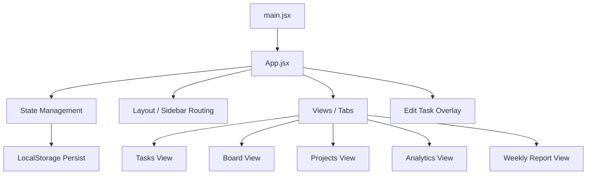

# Task Manager Architecture

This document describes the design, structure, and architecture of the Task Manager React application.

## Directory Structure

```
task-manager/
├── ARCHITECTURE.md       # Architecture documentation (this file)
├── index.html            # Main entrypoint index page for Vite
├── package.json          # Package definition and scripts
├── vite.config.js        # Vite compilation and bundler configuration
└── src/
    ├── App.jsx           # Main React component, state, and business logic
    ├── index.css         # Reset styles, global layout, keyframes, and hover classes
    └── main.jsx          # React DOM mounting entrypoint
```

## System Architecture

The application is structured as a lightweight React SPA (Single Page Application) compiled and served via Vite.



### 1. State Management

The main `App` component acts as the orchestrator of application state, utilizing React's `useState` hooks. It tracks:
* **`view`**: The current tab being displayed (e.g., `'tasks'`, `'board'`, `'projects'`, `'analytics'`, `'weekly'`).
* **`tasks`**: Array of all task items.
* **`projects`**: Array of all projects.
* **`filters`**: Local search and filter settings (search phrase, project filter, urgency level, status).
* **`panel`**: Tracks the display and state of the edit/creation sidebar overlay.
* **`projectForm`**: Draft fields for new project additions.
* **`weekKey`**: Tracks the selected week in the Weekly Report.

### 2. Storage and Hydration

* **Seed Data**: If `localStorage` is empty, a set of default projects and tasks is automatically generated (mocked through `generateSeed`).
* **Persistence**: Every addition, edit, status transition, or deletion triggers a call to `persist()`, updating `localStorage` under the key `tasklog_proto_v1`.

### 3. Rendering and Derived State

To keep state simple and singular, views are rendered dynamically by deriving state in real-time from the master `tasks` list:
* **`decoratedFiltered`**: Applies status pills, urgency dot styles, overdue indicators, and date formatting to filtered tasks for rendering.
* **Board Columns**: Transformed dynamically from statuses (`'todo'`, `'doing'`, `'done'`, `'blocked'`).
* **Project Statistics**: Derived dynamically by counting tasks and statuses for each project to compute completion rates.
* **Analytics**: Real-time aggregation of task averages, weekly completed rates, and completion progression bars.
* **Weekly Report Rows**: Groups and filters completed tasks based on their corresponding monday-of-the-week key.

### 4. Interactive Components & Styling

* **Vanilla CSS**: Global rules, custom font embedding (Source Serif 4), keyframes (`fadeInUp`, `panelIn`), and interactive pseudo-classes (`:hover` overrides for buttons, cards, and list rows) are managed cleanly in `src/index.css`.
* **Drag-and-Drop Board**: Utilizes HTML5 drag events (`onDragStart`, `onDragOver`, `onDrop`) mapped directly to React status transition handlers.
